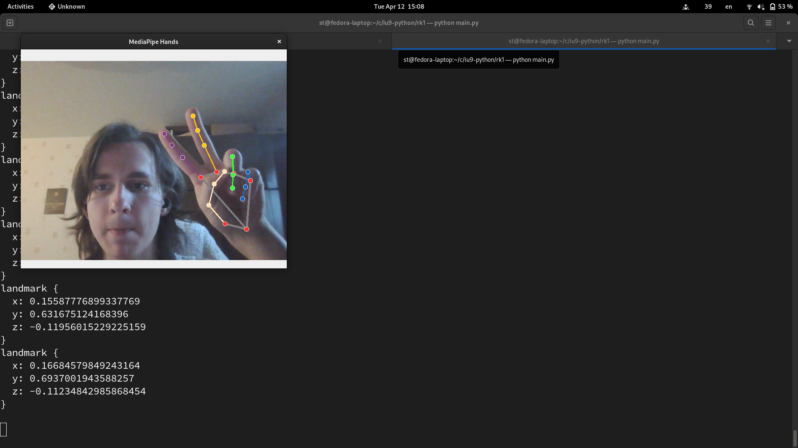

# Цели

Знакомство с возможностями языка Python и библиотеки OpenCV для реализации задач машинного зрения.

# Задачи

Реализовать пример на Python
https://google.github.io/mediapipe/solutions/hands.html#python-solution-api, координаты точек
выводятся списком в консоль. Продемонстрировать работу приложения.

# Решение

